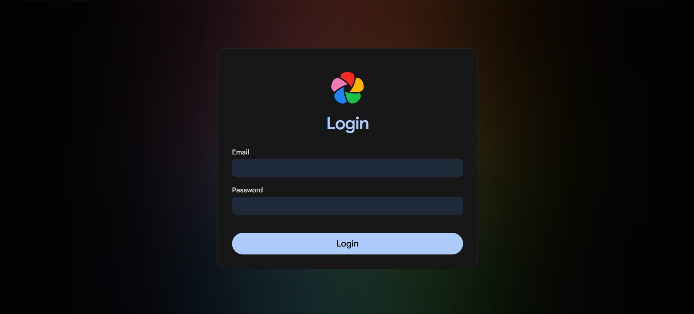
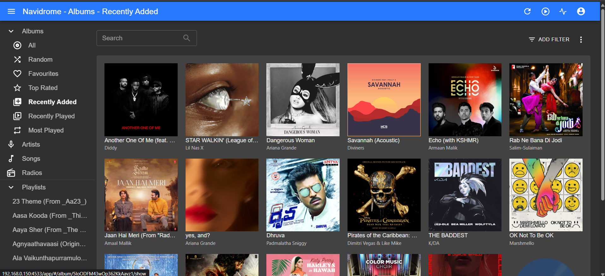

# Configuring Each Application

[← Back to README](../README.md)

---

## Immich — Photo Management

Immich is a self-hosted alternative to Google Photos. It has iOS and Android apps, automatic photo backup, face recognition, and AI-powered search.

**Access:** `http://<server-ip>:<immich-port>`



### First-time setup

1. Open the Immich web UI and create your admin account
2. Go to **Administration → Storage** and confirm the upload path points to `ZimaOS-HD/Gallery`
3. Install the **Immich** mobile app (iOS / Android)
4. In the app settings, set the server URL to your server's local IP (or Tailscale IP for remote access)
5. Enable **automatic backup** in the app — your phone's photos will sync to the server in the background

### Useful settings to configure

- **Storage template** — automatically organise photos into folders by year/month
- **Thumbnail quality** — reduce if the server feels slow during generation
- **Machine learning / face recognition** — can be disabled to save RAM on low-power hardware

---

## Navidrome — Music Streaming

Navidrome indexes your music library and streams it to any Subsonic-compatible app. It's lightweight and works well on low-power hardware.

**Access:** `http://<server-ip>:<navidrome-port>`



### First-time setup

1. Open the Navidrome web UI and create your admin account
2. Place your music files inside `ZimaOS-HD/Media` — Navidrome scans this folder automatically
3. Wait for the initial scan to complete (visible in the dashboard)
4. Connect a Subsonic client app on your phone:
   - [Symfonium](https://symfonium.app/) (Android) — recommended
   - [Substreamer](https://substreamerapp.com/) (iOS)
   - [DSub](https://play.google.com/store/apps/details?id=github.daneren2005.dsub) (Android)
5. In the app, enter your server IP, port, username, and password

---

## Tailscale — VPN & Remote Access

Tailscale creates an encrypted WireGuard mesh between all your devices. Once connected, your phone can reach the home server using a private IP address — from anywhere in the world — without any port forwarding on your router.

### First-time setup

1. Create a free account at [tailscale.com](https://tailscale.com)
2. Open Tailscale from the ZimaOS App Store and log in with your Tailscale account
3. Install Tailscale on your phone and laptop and log in with the same account
4. All devices now appear in your Tailscale admin console with a `100.x.x.x` private IP

### Accessing services remotely

Once Tailscale is running on both your phone and the server, use the server's Tailscale IP instead of the local IP:

```
Immich:     http://100.x.x.x:<immich-port>
Navidrome:  http://100.x.x.x:<navidrome-port>
```

### Testing remote access

1. Turn off your home WiFi on your phone (use mobile data only)
2. Open the Tailscale app — confirm it shows "Connected"
3. Open Immich — you should be able to browse your photos over mobile data

---

[← Installation](Installation.md) · [Next → Remote Access](Remote-Access.md)
