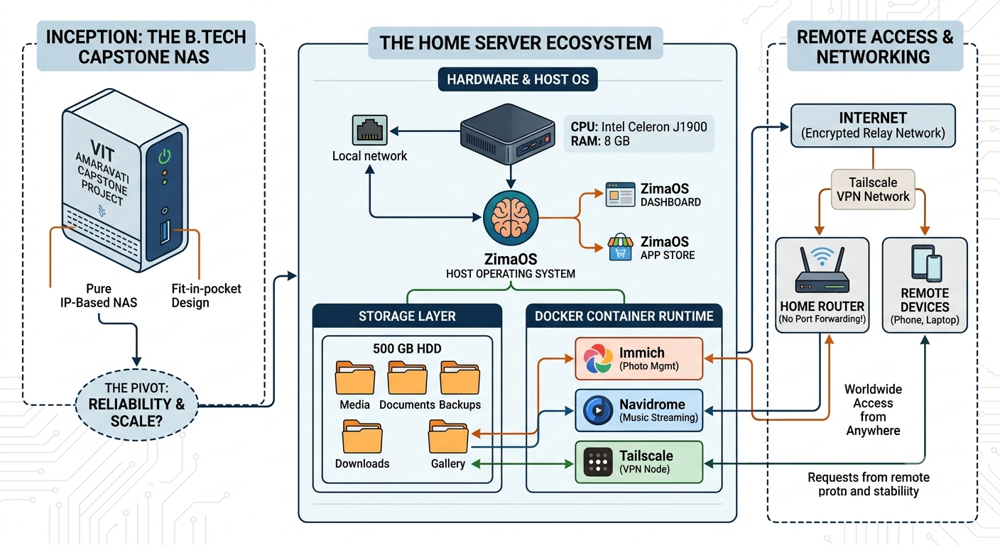

# Architecture

[← Back to README](../README.md)

---



```
                         Internet
                            │
                            ▼
                    ┌───────────────┐
                    │  Tailscale     │
                    │  VPN Network   │
                    └───────┬───────┘
                            │
                            ▼
                    ┌───────────────┐
                    │    Router      │
                    │  Home Network  │
                    └───────┬───────┘
                            │
                            ▼
              ┌─────────────────────────────┐
              │          Mini PC             │
              │   Intel Celeron J1900        │
              │   8 GB RAM · 500 GB HDD      │
              │                              │
              │  ┌────────────────────────┐  │
              │  │        ZimaOS          │  │
              │  │   (Dashboard + App     │  │
              │  │        Store)          │  │
              │  └────────────┬───────────┘  │
              │               │              │
              │  ┌────────────▼───────────┐  │
              │  │   Docker (managed by   │  │
              │  │       ZimaOS)          │  │
              │  │  ┌──────────────────┐  │  │
              │  │  │     Immich        │  │  │
              │  │  ├──────────────────┤  │  │
              │  │  │    Navidrome      │  │  │
              │  │  ├──────────────────┤  │  │
              │  │  │    Tailscale      │  │  │
              │  │  └──────────────────┘  │  │
              │  └────────────────────────┘  │
              │                              │
              │  ┌────────────────────────┐  │
              │  │      500 GB HDD         │  │
              │  │  Gallery / Media /      │  │
              │  │  Documents / Backups /  │  │
              │  │  Downloads              │  │
              │  └────────────────────────┘  │
              └─────────────────────────────┘
```

---

## How Remote Access Works

1. You open Immich or a Subsonic app on your phone, anywhere in the world
2. Tailscale routes the connection through its encrypted relay network
3. Traffic arrives at the Tailscale node running on your server
4. The request reaches Immich or Navidrome running in Docker
5. The response travels back through the same encrypted tunnel

**No open ports. No public IP. No dynamic DNS.**

---

[← Software Stack](Software-Stack.md) · [Next → Installation](Installation.md)
