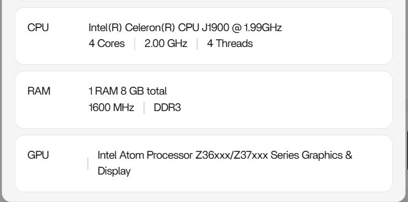

# Hardware

[← Back to README](../README.md)

---



| Component | Specification |
|---|---|
| **CPU** | Intel Celeron J1900 @ 1.99 GHz (quad-core) |
| **RAM** | 8 GB |
| **Storage** | 500 GB HDD |
| **Network** | Ethernet |
| **OS** | ZimaOS |

---

## Why This Hardware Works

The Celeron J1900 is a low-power processor — it draws very little electricity running 24/7, which matters when a server never turns off. 8 GB of RAM is enough to comfortably run ZimaOS with Immich, Navidrome, and Tailscale simultaneously without swapping. The 500 GB HDD is sufficient for a personal photo library and music collection, and can be swapped for a larger drive later without changing anything else about the setup.

---

## Folder Structure on the Drive

ZimaOS organises the HDD into dedicated folders. This is the structure used in this project:

```
ZimaOS-HD/
├── Media/          ← Music library (served by Navidrome)
├── Documents/      ← Personal files and documents
├── Backups/        ← Manual and scheduled backups
├── Downloads/      ← Completed downloads
└── Gallery/        ← Photos and videos (managed by Immich)
```

---

[← Why I Built This](Why-I-Built-This.md) · [Next → Software Stack](Software-Stack.md)
