# Installation & Setup

[← Back to README](../README.md)

---

## Step 1 — Install ZimaOS

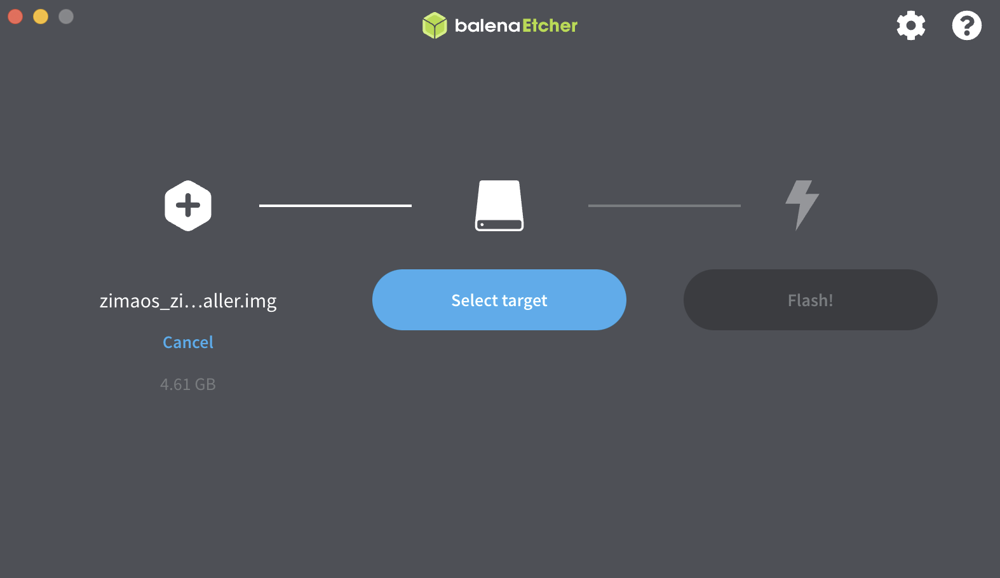
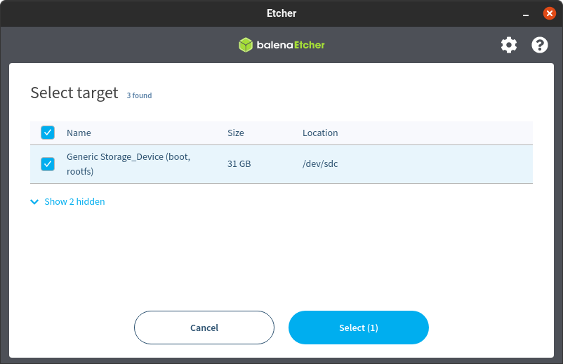
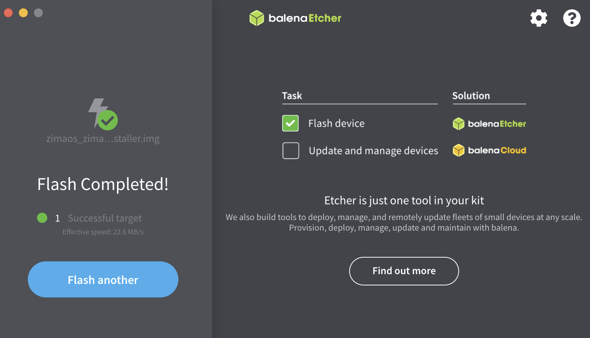
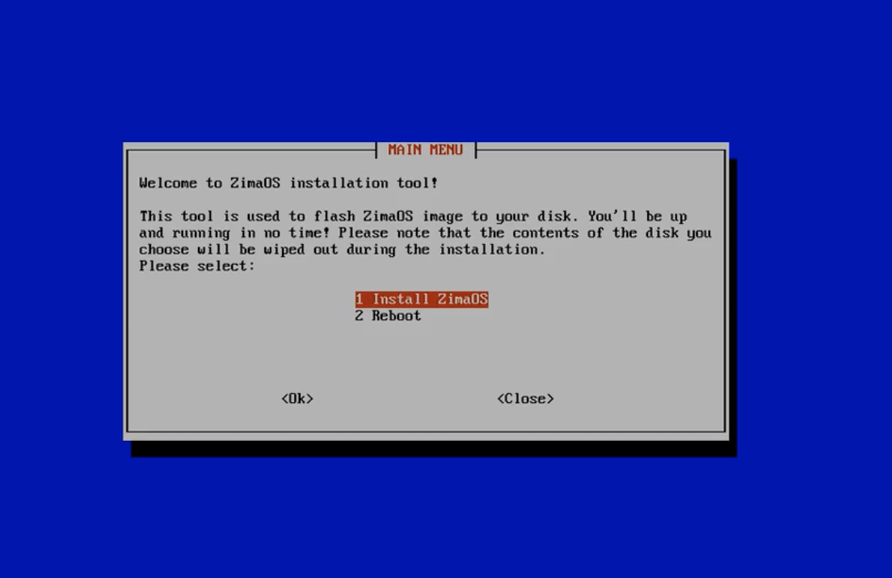
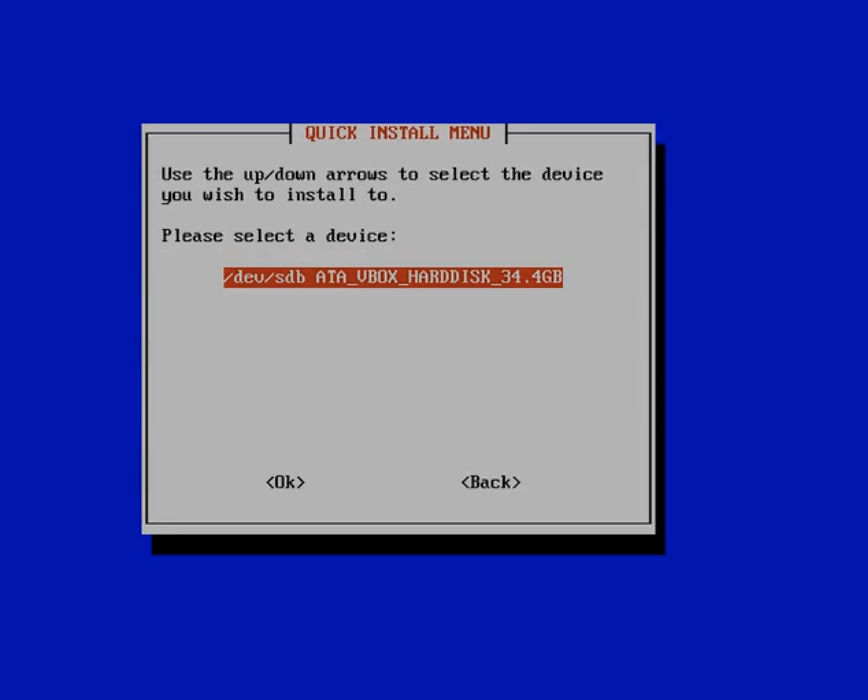
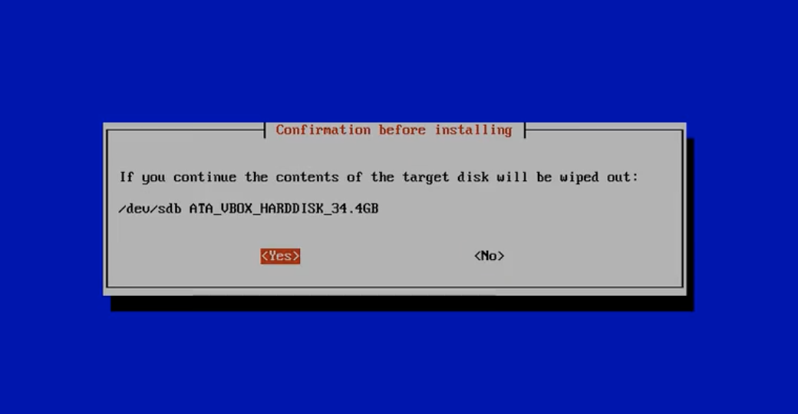
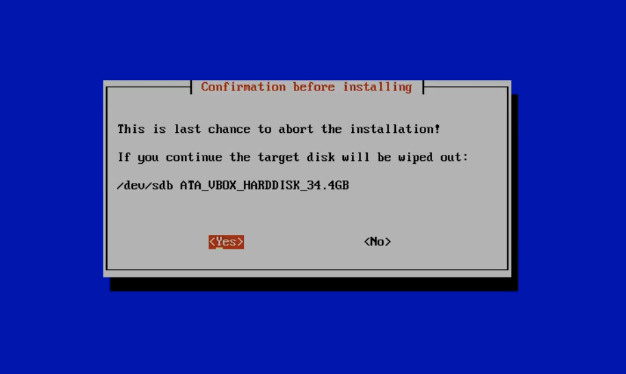
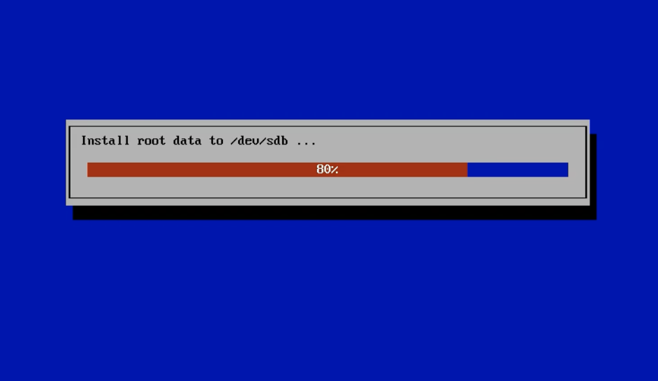
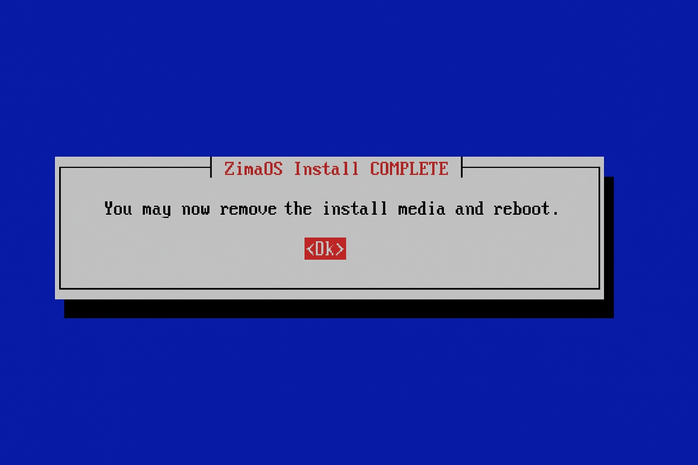
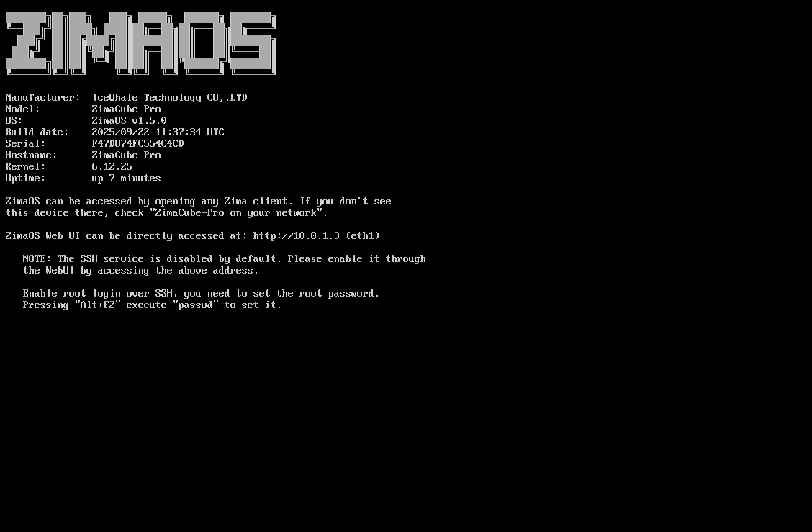

1. Download the ZimaOS image from [zimaos.com](https://www.zimaspace.com/zimaos/download)
2. Flash it to a USB drive using [Balena Etcher](https://etcher.balena.io/) or Rufus
3. Boot your Mini PC from the USB drive (press F2 / F11 / DEL on boot for the boot menu)
4. Follow the on-screen installer and select your HDD as the target drive
5. Create your admin account when prompted
6. Note the local IP address displayed at the end of setup

After installation, access the ZimaOS dashboard from any browser on your local network:

```
http://<your-server-ip>
```

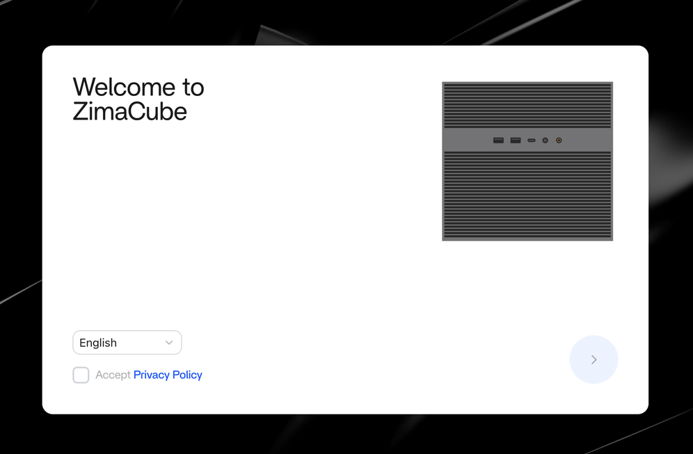

---

## Step 2 — Install Applications from the App Store

ZimaOS has a built-in App Store. No terminal needed for installation.

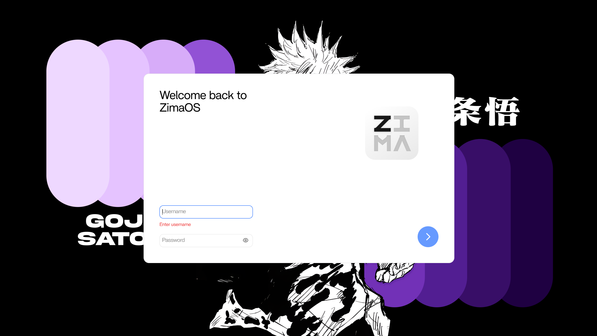

From the ZimaOS dashboard:

1. Open the **App Store**
2. Search for and install each application:
   - **Immich**
   - **Navidrome**
   - **Tailscale**
3. Each app installs as a Docker container managed automatically by ZimaOS

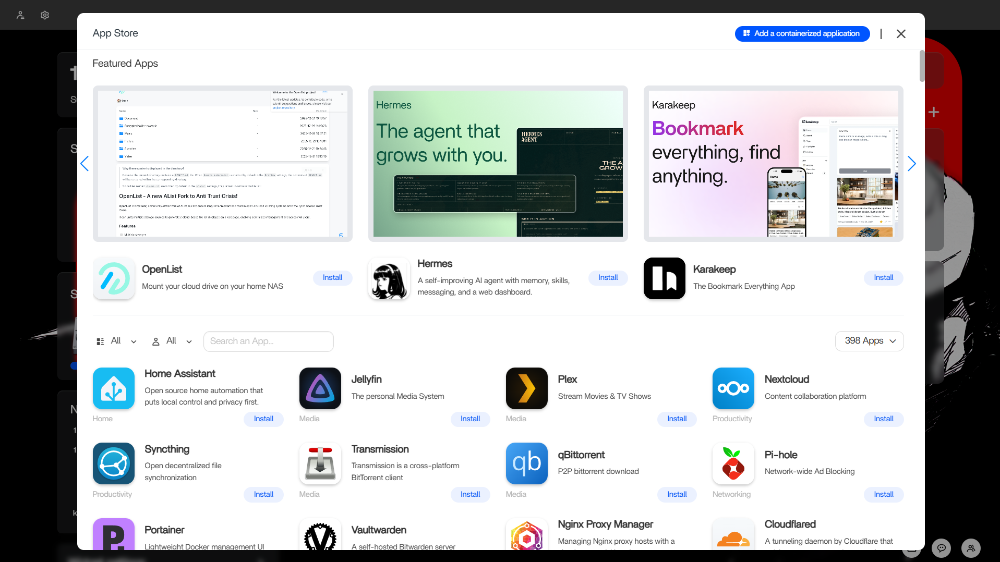

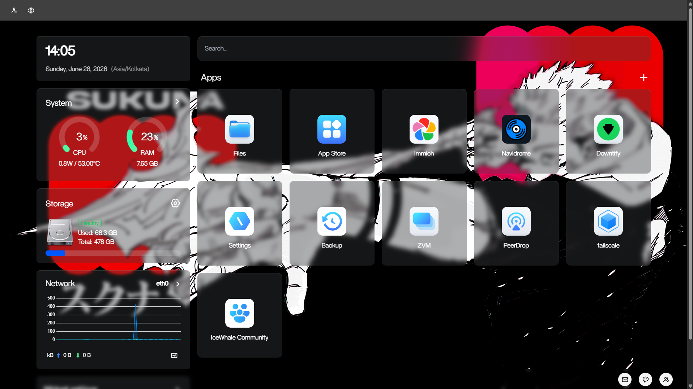

---

## Step 3 — Enable SSH Access

SSH lets you manage the server from a terminal on any device on your network. You'll need it for configuration and troubleshooting.

Enable SSH from the ZimaOS dashboard under **Settings → SSH**, then connect from your laptop:

```bash
ssh admin@<your-server-ip>
```

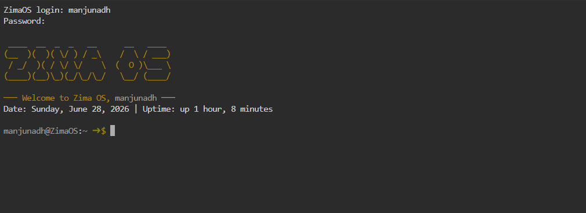

---

[← Architecture](Architecture.md) · [Next → Applications](Applications.md)
